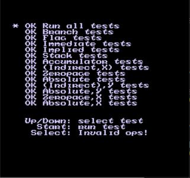
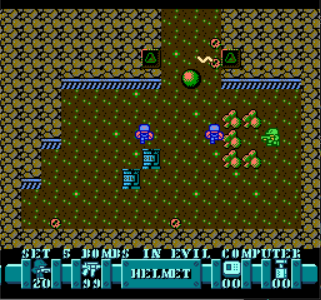

# nes-rust

nes-rust is a NES emulator written in Rust.

[Online Demo](https://raw.githack.com/takahirox/nes-rust/master/index.html)

# Screenshots

[nestest](http://wiki.nesdev.com/w/index.php/Emulator_tests)



[Sgt. Helmet Training Day](http://www.mojontwins.com/juegos_mojonos/sgt-helmet-training-day-nes/)



# How to build and run

## Standalone

You need SDL2. Refer to [Rust-SDL2 Readme](https://github.com/Rust-SDL2/rust-sdl2#rust) for the detail.

```
$ git clone https://github.com/takahirox/nes-rust.git
$ cd nes-rust
$ # install or setup SDL2
$ cargo build --release
$ cargo run --release path_to_rom
```

## Web (WebAssembly)

You need wasm-bindgen client. Refer to [the document](https://rustwasm.github.io/docs/wasm-bindgen/) for the detail.

```
$ git clone https://github.com/takahirox/nes-rust.git
$ cd nes-rust
$ # install wasm-bindgen
$ cargo build --release --lib --target wasm32-unknown-unknown
$ wasm-bindgen ./target/wasm32-unknown-unknown/release/nes_rust.wasm --out-dir ./wasm/ --target web --no-typescript
# Boot up local web server and access index.html via the server
```
